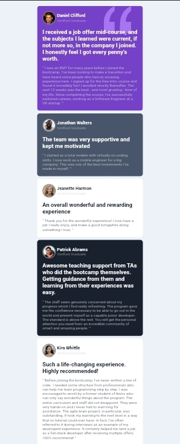
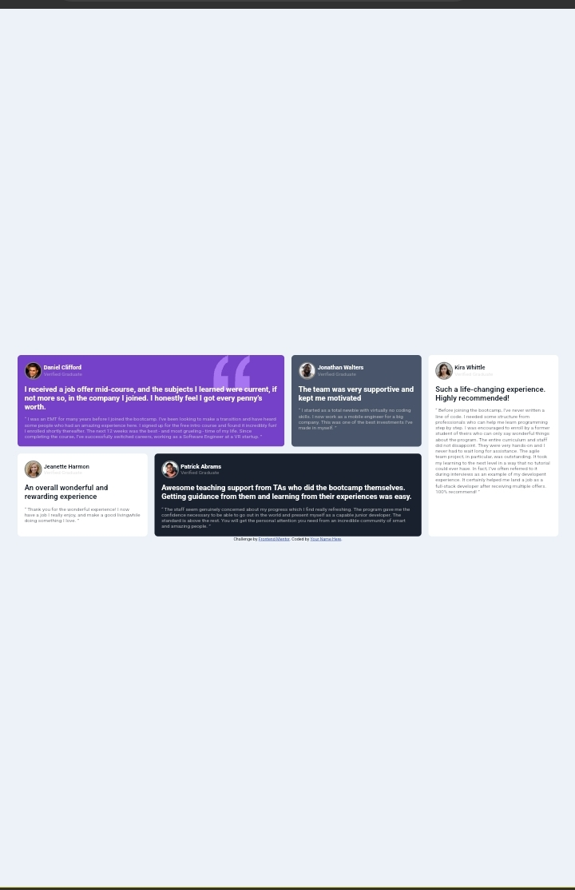

# Frontend Mentor - Testimonials grid section solution

This is a solution to the [Testimonials grid section challenge on Frontend Mentor](https://www.frontendmentor.io/challenges/testimonials-grid-section-Nnw6J7Un7). Frontend Mentor challenges help you improve your coding skills by building realistic projects. 

## Table of contents

- [Overview](#overview)
  - [The challenge](#the-challenge)
  - [Screenshot](#screenshot)
  - [Links](#links)
- [My process](#my-process)
  - [Built with](#built-with)
  - [What I learned](#what-i-learned)
  - [Continued development](#continued-development)
  - [Useful resources](#useful-resources)
- [Author](#author)


## Overview

### The challenge

Users should be able to:

- View the optimal layout for the site depending on their device's screen size

### Screenshot





### Links

- Solution URL: [index](./index.html)
- Live Site URL: [live site from vercel](https://testimonials-grid-section-two-brown.vercel.app/)

## My process

### Built with

- Semantic HTML5 markup
- CSS custom properties
- Flexbox
- CSS Grid
- [Styled Components](https://styled-components.com/) - For styles


### What I learned
    USING CSS GRID TO POSITION ELEMENTS AT DIFFERENT PLACES IN THE VIEWPORT
```CSS
    .container{
      display: grid;
      grid-gap: 20px 20px;
      grid-template-rows: repeat(2, flow);
      grid-template-columns: repeat(4, 1fr);
      grid-template-areas: 
      "dc dc jw kw"
      "jh pa pa kw"
      ;
    }
```

### Continued development

- CSS grid
- Responsive web design
- Advanced CSS concepts 

### Useful resources

- [#37 CSS grid tutorial (complete guide)](https://youtu.be/RhUuMl3R1PE?si=AflGOlBMtrPFtimV) - This helped me know and understand the concept os CSS grid. I really liked this pattern and will use it going forward.


## Author

- Website - [Add your name here](https://www.your-site.com)
- Frontend Mentor - [@Lord-Ace](https://www.frontendmentor.io/profile/Lord-Ace)
